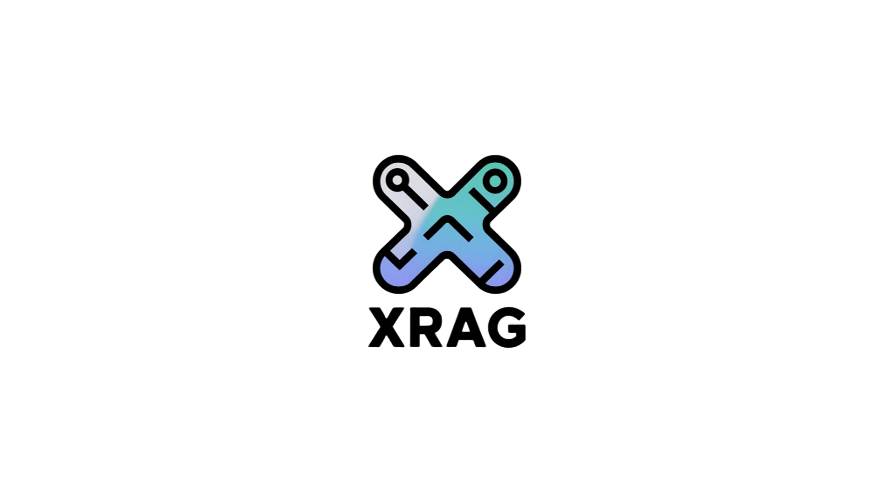

# XRAG


**XRAG: eXamining the Core - Benchmarking Foundational Component Modules in Advanced Retrieval-Augmented Generation**

---

## Introduction

XRAG is a benchmarking framework designed to evaluate the foundational components of advanced Retrieval-Augmented Generation (RAG) systems. By dissecting and analyzing each core module, XRAG provides insights into how different configurations and components impact the overall performance of RAG systems.

---

## Features

- **Modular Benchmarking**: Evaluate individual components such as retrievers, readers, and rankers independently.
- **Configurable Pipelines**: Easily modify configurations to test various setups and components.
- **Extensive Metrics**: Utilize a range of evaluation metrics for comprehensive assessment.
- **Dataset Support**: Built-in support for popular datasets like HotpotQA, with the ability to add custom datasets.
- **Integration with LLMs**: Seamless integration with large language models for generation tasks.

---

## Installation

Before installing XRAG, ensure that you have Python 3.11 or later installed.

### Create a Virtual Environment via conda(Recommended)

```bash
  
# Create a new conda environment
conda create -n xrag python=3.11

# Activate the environment
conda activate xrag
```

### **Install via pip**

You can install XRAG directly using `pip`:

```bash
# Clone the repository
git clone https://github.com/DocAILab/xrag.git
cd xrag

# Install XRAG
pip install .

# Install 'jury' without dependencies to avoid conflicts
pip install jury --no-deps
```
---

## Quick Start

Here's how you can get started with XRAG:

### 1. **Prepare Configuration**: 

Modify the `config.toml` file to set up your desired configurations.

### 2. Using `xrag-cli`

After installing XRAG, the `xrag-cli` command becomes available in your environment. This command provides a convenient way to interact with XRAG without needing to call Python scripts directly.

### **Command Structure**

```bash
xrag-cli [command] [options]
```

### **Commands and Options**

- **run**: Runs the benchmarking process.

  ```bash
  xrag-cli run [--override key=value ...]
  ```

- **webui**: Launches the web-based user interface.

  ```bash
  xrag-cli webui
  ```

- **ver**: Displays the current version of XRAG.

  ```bash
  xrag-cli version
  ```

- **help**: Displays help information.

  ```bash
  xrag-cli help
  ```

### **Overriding Configuration Parameters**

Use the `--override` flag followed by key-value pairs to override configuration settings:

```bash
xrag-cli run --override embeddings="new-embedding-model"
```

---

## Configuration

XRAG uses a `config.toml` file for configuration management. Below is a sample of the configuration file:

```toml
[api_keys]
api_key = "sk-xxxx"
api_base = "https://xxx"
api_name = "chatgpt-3.5"
auth_token = "hf_xxx"

[settings]
llm = "chatgpt-3.5"
embeddings = "BAAI/bge-large-en-v1.5"
split_type = "sentence"
chunk_size = 128
dataset = "hotpot_qa"
source_dir = "../wiki"
persist_dir = "storage"
# ... additional settings ...
```

---

## Troubleshooting

- **Dependency Conflicts**: If you encounter dependency issues, ensure that you have the correct versions specified in `requirements.txt` and consider using a virtual environment.

- **Invalid Configuration Keys**: Ensure that the keys you override match exactly with those in the `config.toml` file.

- **Data Type Mismatches**: When overriding configurations, make sure the values are of the correct data type (e.g., integers, booleans).

---

## Changelog

### Version 0.1.0

- Initial release with core benchmarking functionality.
- Support for HotpotQA dataset.
- Command-line configuration overrides.
- Introduction of the `xrag-cli` command-line tool.

---

## Feedback and Support

We value feedback from our users. If you have suggestions, feature requests, or encounter issues:

- **Open an Issue**: Submit an issue on our [GitHub repository](https://github.com/DocAILab/xrag/issues).
- **Email Us**: Reach out at [luoyangyifei@buaa.edu.cn](mailto:luoyangyifei@buaa.edu.cn).
- **Join the Discussion**: Participate in discussions and share your insights.

---

## Thank You

Thank you for using XRAG! We hope it proves valuable in your research and development efforts in the field of Retrieval-Augmented Generation.