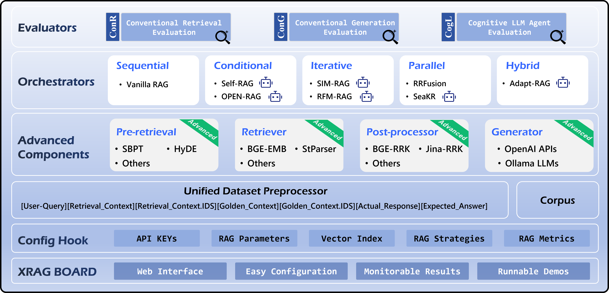
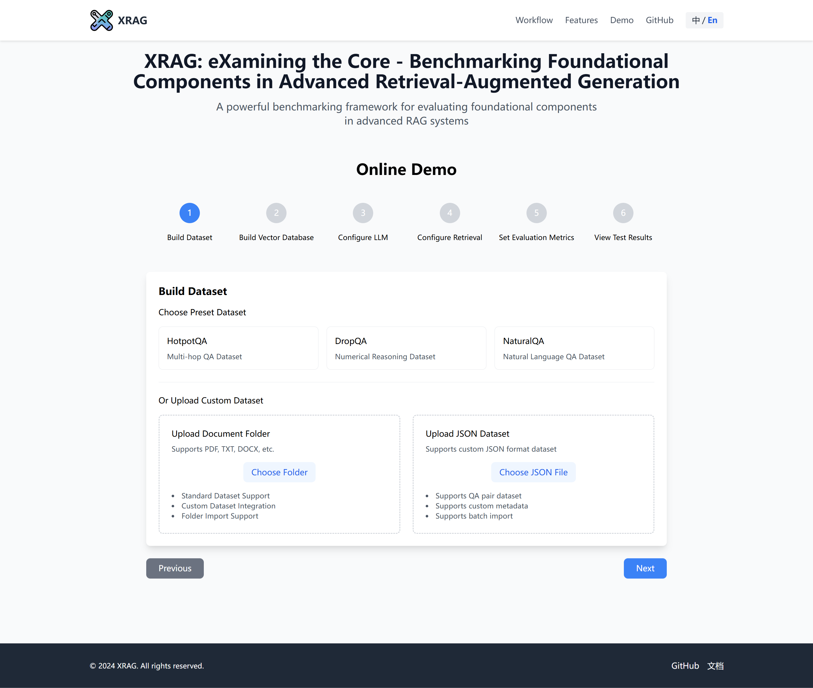
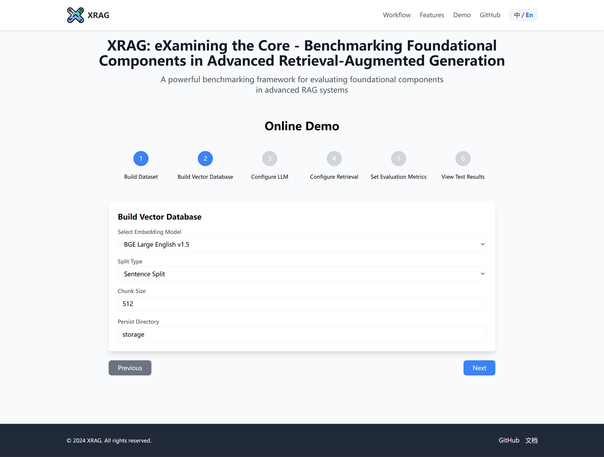
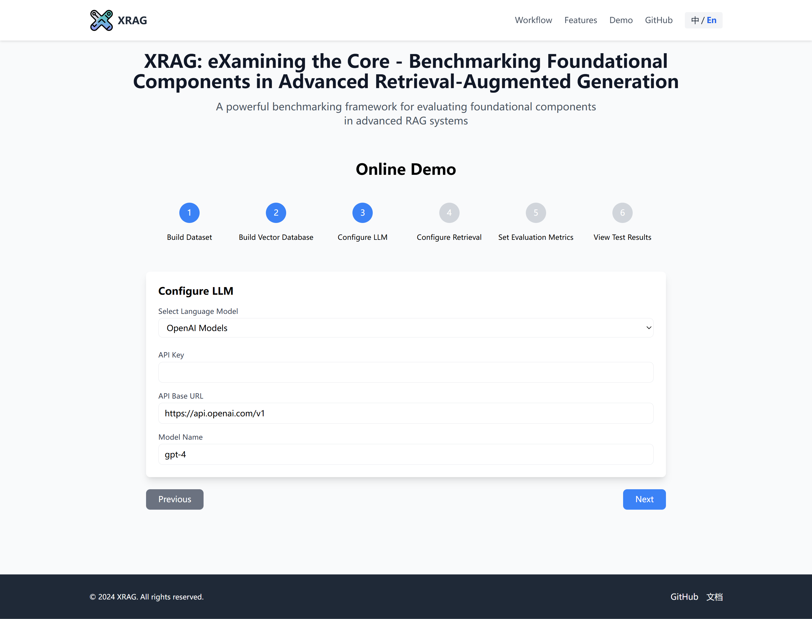
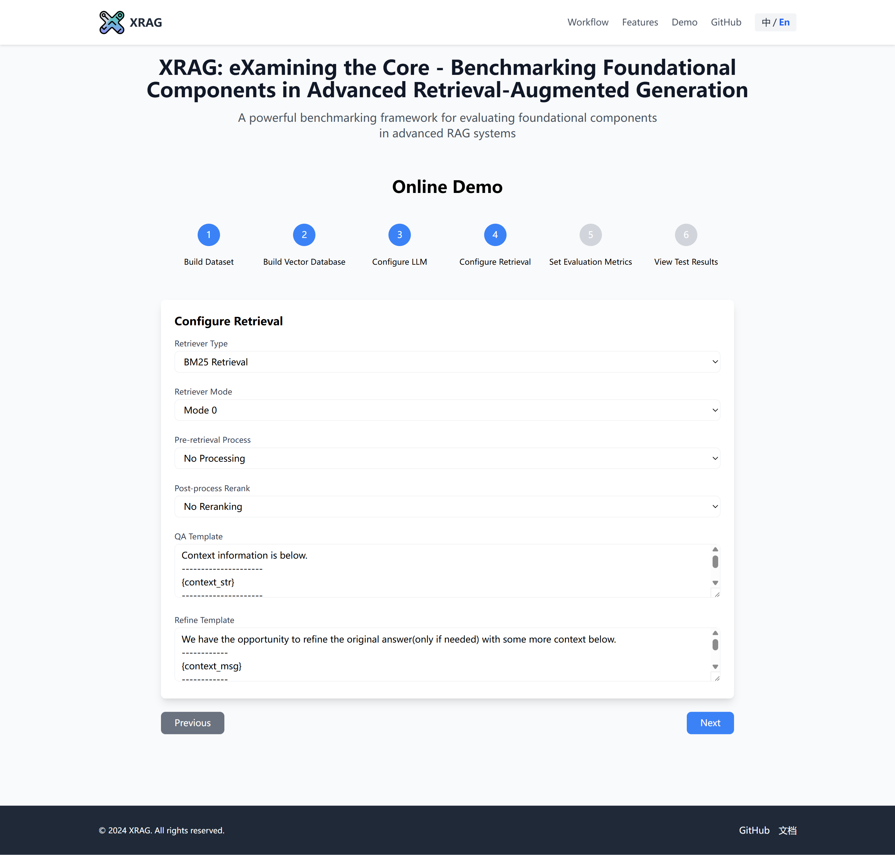
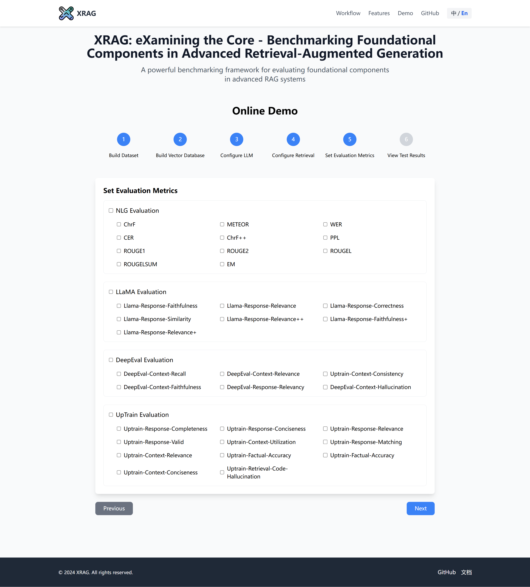

<div style="display: flex; justify-content: center; align-items: center; height: 100px;">
  <h1 style="font-size: 48px;">
    XRAG: eXamining the Core - Benchmarking Foundational Component Modules in Advanced Retrieval-Augmented Generation
  </h1>
</div>


[](https://badge.fury.io/py/examinationrag)
[](https://pypi.org/project/examinationrag/)
[](https://github.com/DocAILab/XRAG/blob/main/LICENSE)
[](https://pepy.tech/project/examinationrag)
[](https://github.com/DocAILab/XRAG/stargazers)
[](https://github.com/DocAILab/XRAG/issues)
[](https://arxiv.org/abs/2412.15529)

## 馃搼 Table of Contents

- [:mega: Updates](#mega-updates)
- [:book: Introduction](#-introduction)
- [:sparkles: Features](#-features)
- [:globe_with_meridians: WebUI Demo](#-webui-demo)
- [:hammer_and_wrench: Installation](#锔?installation)
- [:rocket: Quick Start](#-quick-start)
- [:gear: Configuration](#锔?configuration)
- [:warning: Troubleshooting](#-troubleshooting)
- [:clipboard: Changelog](#-changelog)
- [:speech_balloon: Feedback and Support](#-feedback-and-support)
- [:round_pushpin: Acknowledgement](#round_pushpin-acknowledgement)
- [:books: Citation](#-citation)

## :mega: Updates
- **2025-11.18: Add orchestrators: SIM-rag.**
- **2025-11.05: Add orchestrators: self-rag, adaptive-rag.**
- **2025-07.18: Add Text Splitters, including SemanticSplitterNodeParser, SentenceSplitterNodeParser, and SentenceWindowNodeParser.**
- **2025-06.23: Update configuration file锛宲arameters appear clearer.**
- **2025-01.09: Add API support. Now you can use XRAG as a backend service.**
- **2025-01.06: Add ollama LLM support.**
- **2025-01.05: Add generate command. Now you can generate your own QA pairs from a folder which contains your documents.**
- **2024-12.23: XRAG Documentation is released**馃寛.
- **2024-12.20: XRAG is released**馃帀.

# XRAG Roadmap

Welcome developers, researchers, and enthusiasts to join the XRAG open-source project! 

## 馃搳 Novel Novel Evaluation Metrics
- [ ] **Semantic Perplexity (SePer)**
- [ ] **Entropy** & **Semantic Entropy**
- [ ] **Auto-J**
- [ ] **Prometheus**

## 馃 LLM Experiments (Various Parameter Sizes)
- [ ] **PGE/GTE/M3E** embeddings
- [ ] **30B/more-parameter models** via OpenAI API or Ollama


## 馃 Ever-Evolving Agent Workflows
- [ ] **Adaptive Retrieval**
- [ ] **Multi-step Approach**
- [ ] **Self-RAG**
- [ ] **FLARE**
- [ ] **Adaptive-RAG**

## 馃搳 Other Novel RAG modules
- [ ] **Late Chunking**

> 馃檶 Your contributions鈥攃ode, data, ideas, or feedback鈥攁re the heartbeat of XRAG!  
> Repository: [https://github.com/DocAILab/XRAG](https://github.com/DocAILab/XRAG)


---
## 馃摉 Introduction

XRAG is a benchmarking framework designed to evaluate the foundational components of advanced Retrieval-Augmented Generation (RAG) systems. By dissecting and analyzing each core module, XRAG provides insights into how different configurations and components impact the overall performance of RAG systems.

---

## 鉁?Features

- **馃攳 Comprehensive Evaluation Framework**: 
  - Multiple evaluation dimensions: LLM-based evaluation, Deep evaluation, and traditional metrics
  - Support for evaluating retrieval quality, response faithfulness, and answer correctness
  - Built-in evaluation models including LlamaIndex, DeepEval, and custom metrics

- **鈿欙笍 Flexible Architecture**:
  - Modular design with pluggable components for retrievers, embeddings, and LLMs
  - Support for various retrieval methods: Vector, BM25, Hybrid, and Tree-based
  - Easy integration with custom retrieval and evaluation strategies

- **馃 Multiple LLM Support**:
  - Seamless integration with OpenAI models
  - Support for local models (Qwen, LLaMA, etc.)
  - Configurable model parameters and API settings

- **馃搳 Rich Evaluation Metrics**:
  - Traditional metrics: F1, EM, MRR, Hit@K, MAP, NDCG
  - LLM-based metrics: Faithfulness, Relevancy, Correctness
  - Deep evaluation metrics: Contextual Precision/Recall, Hallucination, Bias

- **馃幆 Advanced Retrieval Methods**:
  - BM25-based retrieval
  - Vector-based semantic search
  - Tree-structured retrieval
  - Keyword-based retrieval
  - Document summary retrieval
  - Custom retrieval strategies

- **馃捇 User-Friendly Interface**:
  - Command-line interface with rich options
  - Web UI for interactive evaluation
  - Detailed evaluation reports and visualizations

---

## 馃寪 WebUI Demo

XRAG provides an intuitive web interface for interactive evaluation and visualization. Launch it with:

```bash
xrag-cli webui
```

The WebUI guides you through the following workflow:

### 1. Dataset Upload and Configuration


Upload and configure your datasets:
- Support for benchmark datasets (HotpotQA, DropQA, NaturalQA)
- Custom dataset integration
- Automatic format conversion and preprocessing

### 2. Index Building and Configuration


Configure system parameters and build indices:
- API key configuration
- Parameter settings
- Vector database index construction
- Chunk size optimization

### 3. RAG Strategy Configuration


Define your RAG pipeline components:
- Pre-retrieval methods
- Retriever selection
- Post-processor configuration
- Custom prompt template creation

### 4. Interactive Testing


Test your RAG system interactively:
- Real-time query testing
- Retrieval result inspection
- Response generation review
- Performance analysis

### 5. Comprehensive Evaluation



## 馃洜锔?Installation

Before installing XRAG, ensure that you have Python 3.11 or later installed.

### Create a Virtual Environment via conda(Recommended)

```bash
  
# Create a new conda environment
conda create -n xrag python=3.11

# Activate the environment
conda activate xrag
```

### **Install via pip**

You can install XRAG directly using `pip`:

```bash
# Install XRAG
pip install examinationrag

# Install 'jury' without dependencies to avoid conflicts
pip install jury --no-deps

# Adjust some package versions
pip install requests==2.27.1
pip install urllib3==1.25.11
pip install jiwer<4.0.0
```
---

## 馃殌 Quick Start

Here's how you can get started with XRAG:

### 1. **Prepare Configuration**: 

Modify the `config.toml` file to set up your desired configurations.

### 2. Using `xrag-cli`

After installing XRAG, the `xrag-cli` command becomes available in your environment. This command provides a convenient way to interact with XRAG without needing to call Python scripts directly.

### **Command Structure**

```bash
xrag-cli [command] [options]
```

### **Commands and Options**

- **run**: Runs the benchmarking process.

  ```bash
  xrag-cli run [--override key=value ...]
  ```

- **webui**: Launches the web-based user interface.

  ```bash
  xrag-cli webui
  ```

- **ver**: Displays the current version of XRAG.

  ```bash
  xrag-cli version
  ```

- **help**: Displays help information.

  ```bash
  xrag-cli help
  ```

- **generate**: Generate QA pairs from a folder.

  ```bash
  xrag-cli generate -i <input_file> -o <output_file> -n <num_questions> -s <sentence_length>
  ```

- **api**: Launch the API server for XRAG services.

  ```bash
  xrag-cli api [--host <host>] [--port <port>] [--json_path <json_path>] [--dataset_folder <dataset_folder>]
  ```

  Options:
  - `--host`: API server host address (default: 0.0.0.0)
  - `--port`: API server port number (default: 8000)
  - `--json_path`: Path to the JSON configuration file
  - `--dataset_folder`: Path to the dataset folder

### **Using the API Service**

Once the API server is running, you can interact with it using HTTP requests. Here are the available endpoints:

#### 1. Query Endpoint

Send a POST request to `/query` to get answers based on your documents:

```bash
curl -X POST "http://localhost:8000/query" \
     -H "Content-Type: application/json" \
     -d '{
           "query": "your question here",
           "top_k": 3
         }'
```

Response format:
```json
{
    "answer": "Generated answer to your question",
    "sources": [
        {
            "content": "Source document content",
            "id": "document_id",
            "score": 0.85
        }
    ]
}
```

#### 2. Health Check

Check the API server status with a GET request to `/health`:

```bash
curl "http://localhost:8000/health"
```

Response format:
```json
{
    "status": "healthy",
    "engine_type": "default",
    "engine_status": "initialized"
}
```

The API service supports both custom JSON datasets and folder-based documents:
- Use `--json_path` for JSON format QA datasets
- Use `--dataset_folder` for document folders
- Do **not** set `--json_path` and `--dataset_folder` at the same time.

  

### **Overriding Configuration Parameters**

Use the `--override` flag followed by key-value pairs to override configuration settings:

```bash
xrag-cli run --override embeddings="new-embedding-model"
```

### **Using Open-RAG**

XRAG supports Open-RAG as an orchestrator via the `[open_rag]` section in `config.toml`.

```toml
[open_rag]
enabled = true
model_name = "shayekh/openrag_llama2_7b_8x135m"
mode = "adaptive_retrieval"
n_docs = 3
max_new_tokens = 100
threshold = 0.0
use_groundness = true
use_utility = true
use_seqscore = true
w_rel = 1.0
w_sup = 1.0
w_use = 0.5
trust_remote_code = true
```

You can also override nested keys from CLI:

```bash
xrag-cli run --override open_rag.enabled=true open_rag.n_docs=5
```

Note: only one orchestrator can be enabled at a time (`self_rag`, `adaptive_rag`, `sim_rag`, `open_rag`).

### **Generate QA pairs from a folder**

```bash
xrag-cli generate -i <input_file> -o <output_file> -n <num_questions> -s <sentence_length>
```

Automatically generate QA pairs from a folder.

---

## 鈿欙笍 Configuration

XRAG uses a `config.toml` file for configuration management. Here's a detailed explanation of the configuration options:

```toml
[api_keys]
api_key = "sk-xxxx"          # Your API key for LLM service
api_base = "https://xxx"     # API base URL
api_name = "gpt-4o"     # Model name
auth_token = "hf_xxx"        # Hugging Face auth token

[settings]
llm = "openai" # openai, huggingface, ollama
ollama_model = "llama2:7b" # ollama model name
huggingface_model = "llama" # huggingface model name
embeddings = "BAAI/bge-large-en-v1.5"
split_type = "sentence"
chunk_size = 128
dataset = "hotpot_qa"
persist_dir = "storage"
# ... additional settings ...
```

---

## 鉂?Troubleshooting

- **Dependency Conflicts**: If you encounter dependency issues, ensure that you have the correct versions specified in `requirements.txt` and consider using a virtual environment.

- **Invalid Configuration Keys**: Ensure that the keys you override match exactly with those in the `config.toml` file.

- **Data Type Mismatches**: When overriding configurations, make sure the values are of the correct data type (e.g., integers, booleans).

---

## 馃摑 Changelog


### Version 0.1.3

- Add API support. Now you can use XRAG as a backend service.

### Version 0.1.2
- Add ollama LLM support.

### Version 0.1.1
- Add generate command. Now you can generate your own QA pairs from a folder which contains your documents.

### Version 0.1.0

- Initial release with core benchmarking functionality.
- Support for HotpotQA dataset.
- Command-line configuration overrides.
- Introduction of the `xrag-cli` command-line tool.

---

## 馃挰 Feedback and Support

We value feedback from our users. If you have suggestions, feature requests, or encounter issues:

- **Open an Issue**: Submit an issue on our [GitHub repository](https://github.com/DocAILab/xrag/issues).
- **Email Us**: Reach out at [luoyangyifei@buaa.edu.cn](mailto:luoyangyifei@buaa.edu.cn).
- **Join the Discussion**: Participate in discussions and share your insights.

---


## :round_pushpin: Acknowledgement

- Organizers: [Qianren Mao](https://github.com/qianrenmao), [Yangyifei Luo (缃楁潹涓€椋?](https://github.com/lyyf2002), [Qili Zhang (寮犲惎绔?](https://github.com/xiaolizhang77), [Yashuo Luo (缃椾簹纭?](https://github.com/luoyashuo), [Zhilong Cao(鏇逛箣榫?](https://github.com/afdafczl), [Jinlong Zhang (寮犻噾榫?](https://github.com/therealoliver), [Hanwen Hao (閮濈€氭枃)](https://github.com/TheSleepGod), [Zhenting Huang (榛勬尟搴?](https://github.com/hztBUAA), [Feng Yan(闂赴)](https://github.com/WnRock), [Weifeng Jiang (钂嬩负宄?](https://github.com/therealoliver).

- This project is inspired by [RAGLAB](https://github.com/fate-ubw/RAGLab), [FlashRAG](https://github.com/RUC-NLPIR/FlashRAG), [FastRAG](https://github.com/IntelLabs/fastRAG), [AutoRAG](https://github.com/Marker-Inc-Korea/AutoRAG), [LocalRAG](https://github.com/jasonyux/LocalRQA).

- We are deeply grateful for the following external libraries, which have been pivotal to the development and functionality of our project:  [LlamaIndex](https://docs.llamaindex.ai/en/stable/), [Hugging Face Transformers](https://github.com/huggingface/transformers).

## 馃摎 Citation

If you find this work helpful, please cite our paper:

```bibtex
@article{mao2025xragexaminingcore,
      title={XRAG: eXamining the Core -- Benchmarking Foundational Components in Advanced Retrieval-Augmented Generation}, 
      author={Qianren Mao and Yangyifei Luo and Qili Zhang and Yashuo Luo and Zhilong Cao and Jinlong Zhang and HanWen Hao and Zhijun Chen and Weifeng Jiang and Junnan Liu and Xiaolong Wang and Zhenting Huang and Zhixing Tan and Sun Jie and Bo Li and Xudong Liu and Richong Zhang and Jianxin Li},
      year={2025},
      eprint={2412.15529},
      archivePrefix={arXiv},
      primaryClass={cs.CL},
      url={https://arxiv.org/abs/2412.15529}, 
}
```

## 馃檹 Thank You

Thank you for using XRAG! We hope it proves valuable in your research and development efforts in the field of Retrieval-Augmented Generation.
