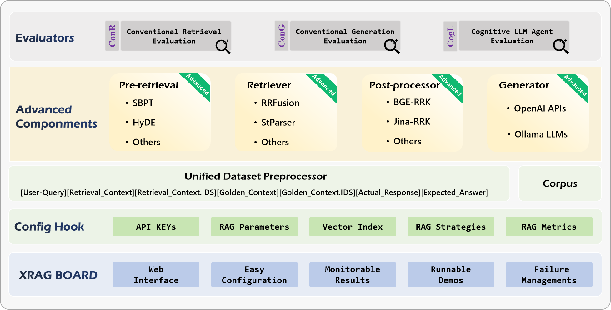

<div style="display: flex; justify-content: center; align-items: center; height: 100px;">
  <h1 style="font-size: 48px;">
    XRAG: eXamining the Core - Benchmarking Foundational Component Modules in Advanced Retrieval-Augmented Generation
  </h1>
</div>


---

[](https://badge.fury.io/py/examinationrag)
[](https://pypi.org/project/examinationrag/)
[](https://github.com/DocAILab/XRAG/blob/main/LICENSE)
[](https://pepy.tech/project/examinationrag)
[](https://github.com/DocAILab/XRAG/stargazers)
[](https://github.com/DocAILab/XRAG/issues)

---

## :mega: Updates

- **2024-12.23: XRAG Documentation is released**🌈.
- **2024-12.20: XRAG is released**🎉.
---
## 📖 Introduction

XRAG is a benchmarking framework designed to evaluate the foundational components of advanced Retrieval-Augmented Generation (RAG) systems. By dissecting and analyzing each core module, XRAG provides insights into how different configurations and components impact the overall performance of RAG systems.

---

## ✨ Features

- **🔍 Comprehensive Evaluation Framework**: 
  - Multiple evaluation dimensions: LLM-based evaluation, Deep evaluation, and traditional metrics
  - Support for evaluating retrieval quality, response faithfulness, and answer correctness
  - Built-in evaluation models including LlamaIndex, DeepEval, and custom metrics

- **⚙️ Flexible Architecture**:
  - Modular design with pluggable components for retrievers, embeddings, and LLMs
  - Support for various retrieval methods: Vector, BM25, Hybrid, and Tree-based
  - Easy integration with custom retrieval and evaluation strategies

- **🤖 Multiple LLM Support**:
  - Seamless integration with OpenAI models
  - Support for local models (Qwen, LLaMA, etc.)
  - Configurable model parameters and API settings

- **📊 Rich Evaluation Metrics**:
  - Traditional metrics: F1, EM, MRR, Hit@K, MAP, NDCG
  - LLM-based metrics: Faithfulness, Relevancy, Correctness
  - Deep evaluation metrics: Contextual Precision/Recall, Hallucination, Bias

- **🎯 Advanced Retrieval Methods**:
  - BM25-based retrieval
  - Vector-based semantic search
  - Tree-structured retrieval
  - Keyword-based retrieval
  - Document summary retrieval
  - Custom retrieval strategies

- **💻 User-Friendly Interface**:
  - Command-line interface with rich options
  - Web UI for interactive evaluation
  - Detailed evaluation reports and visualizations

---

## 🛠️ Installation

Before installing XRAG, ensure that you have Python 3.11 or later installed.

### Create a Virtual Environment via conda(Recommended)

```bash
  
# Create a new conda environment
conda create -n xrag python=3.11

# Activate the environment
conda activate xrag
```

### **Install via pip**

You can install XRAG directly using `pip`:

```bash
# Install XRAG
pip install examinationrag

# Install 'jury' without dependencies to avoid conflicts
pip install jury --no-deps
```
---

## 🚀 Quick Start

Here's how you can get started with XRAG:

### 1. **Prepare Configuration**: 

Modify the `config.toml` file to set up your desired configurations.

### 2. Using `xrag-cli`

After installing XRAG, the `xrag-cli` command becomes available in your environment. This command provides a convenient way to interact with XRAG without needing to call Python scripts directly.

### **Command Structure**

```bash
xrag-cli [command] [options]
```

### **Commands and Options**

- **run**: Runs the benchmarking process.

  ```bash
  xrag-cli run [--override key=value ...]
  ```

- **webui**: Launches the web-based user interface.

  ```bash
  xrag-cli webui
  ```

- **ver**: Displays the current version of XRAG.

  ```bash
  xrag-cli version
  ```

- **help**: Displays help information.

  ```bash
  xrag-cli help
  ```

### **Overriding Configuration Parameters**

Use the `--override` flag followed by key-value pairs to override configuration settings:

```bash
xrag-cli run --override embeddings="new-embedding-model"
```

---

## ⚙️ Configuration

XRAG uses a `config.toml` file for configuration management. Here's a detailed explanation of the configuration options:

```toml
[api_keys]
api_key = "sk-xxxx"          # Your API key for LLM service
api_base = "https://xxx"     # API base URL
api_name = "gpt-4o"     # Model name
auth_token = "hf_xxx"        # Hugging Face auth token

[settings]
llm = "chatgpt-3.5"
embeddings = "BAAI/bge-large-en-v1.5"
split_type = "sentence"
chunk_size = 128
dataset = "hotpot_qa"
persist_dir = "storage"
# ... additional settings ...
```

---

## ❗ Troubleshooting

- **Dependency Conflicts**: If you encounter dependency issues, ensure that you have the correct versions specified in `requirements.txt` and consider using a virtual environment.

- **Invalid Configuration Keys**: Ensure that the keys you override match exactly with those in the `config.toml` file.

- **Data Type Mismatches**: When overriding configurations, make sure the values are of the correct data type (e.g., integers, booleans).

---

## 📝 Changelog

### Version 0.1.0

- Initial release with core benchmarking functionality.
- Support for HotpotQA dataset.
- Command-line configuration overrides.
- Introduction of the `xrag-cli` command-line tool.

---

## 💬 Feedback and Support

We value feedback from our users. If you have suggestions, feature requests, or encounter issues:

- **Open an Issue**: Submit an issue on our [GitHub repository](https://github.com/DocAILab/xrag/issues).
- **Email Us**: Reach out at [luoyangyifei@buaa.edu.cn](mailto:luoyangyifei@buaa.edu.cn).
- **Join the Discussion**: Participate in discussions and share your insights.

---


## :round_pushpin: Acknowledgement

- Organizers: [Qianren Mao](https://github.com/qianrenmao), [Yangyifei Luo (罗杨一飞)](https://github.com/lyyf2002), [Jinlong Zhang (张金龙)](https://github.com/therealoliver), [Hanwen Hao (郝瀚文)](https://github.com/TheSleepGod).

- This project is inspired by [RAGLAB](https://github.com/fate-ubw/RAGLab), [FlashRAG](https://github.com/RUC-NLPIR/FlashRAG), [FastRAG](https://github.com/IntelLabs/fastRAG), [AutoRAG](https://github.com/Marker-Inc-Korea/AutoRAG), [LocalRAG](https://github.com/jasonyux/LocalRQA).

- We are deeply grateful for the following external libraries, which have been pivotal to the development and functionality of our project:  [LlamaIndex](https://docs.llamaindex.ai/en/stable/), [Hugging Face Transformers](https://github.com/huggingface/transformers).

## 🙏 Thank You

Thank you for using XRAG! We hope it proves valuable in your research and development efforts in the field of Retrieval-Augmented Generation.
